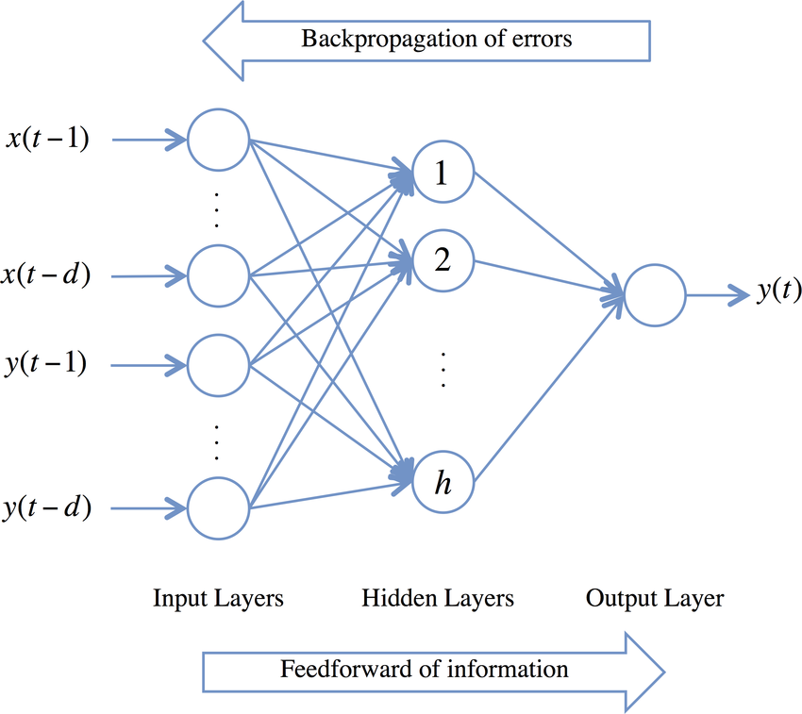
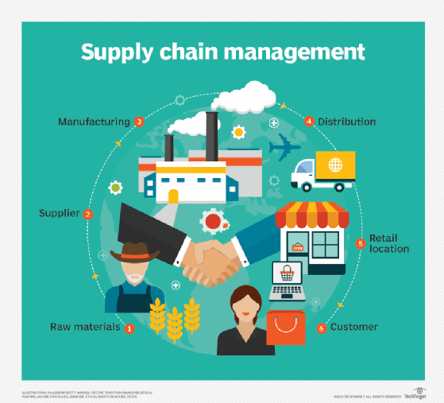

Future Features
===============

We would like to extend our package in a few different ways:

Module Extension
----------------

Reverse Mode
~~~~~~~~~~~~

This improvement will allow our users to play with custom Neural Network models using backpropagation. Since we have performed forward mode successfully, it should not be a big deal.

Second order derivative approximates
~~~~~~~~~~~~~~~~~~~~~~~~~~~~~~~~~~~~

It would be beneficial to extend our package to account for calculating second derivatives, because many algorithms and methods rely on computing the second derivitve (single variable case) or the Hessian matrix (multivariable case). By handing this case,
our package will be more user-friendly and can be applied to more algorithms that require this calculation.

Possible Applications
----------------------

1. Hospital Scheduling 
~~~~~~~~~~~~~~~~~~~~~~

	
A good potential application would be in the health science. In many countries, at the hospital patients have to queue and wait for a long time for many procedures, from register to meeting doctor to taking medicine. This could be modeled as a schedule optimization problem. With the automatic differentiation many algorithms could be applied to solving this scheduling problem, which could greatly improve the efficiency in the hospital.
	

2. Supply Chain Management 
~~~~~~~~~~~~~~~~~~~~~~~~~~

	
As for the optimization, a good example would be supply chain management. Supply chain management is the management of the flow of goods and services, involves the movement and storage of raw materials, of work-in-process inventory, and of finished goods from point of origin to point of consumption. Often it could be modeled as a complex optimization problem. With our package we can try to solve those hard problems and thus make contribute to the lower cost during this management. 

3. Obesity Prevention:
~~~~~~~~~~~~~~~~~~~~~~~~~~

A relatively recent `Harvard health article <https://www.hsph.harvard.edu/obesity-prevention-source/ethnic-differences-in-bmi-and-disease-risk/>`_ found that while Asian body types are categorized as "skinny", there is a higher risk for type 2 diabetes among this race. This is because type 2 diabetes is correlated with body fat percentage. Because Asians typically have a smaller body size, they are mistaken for being "healthy" even with poor eating habits.
Consequently, those with poor eating habits could have a larger percentage of body fat, but it is disguised as "skinny fat". It would be interesting to model the body statistics (i.e. BMI, body fat percentage, height, weight, etc.) of this particular subgroup and determine the optimal diet plan to help reduce their risk of type 2 diabetes. This could be done by using an optimization algorithm to find the amount of nutrients that could help their body quickly recover. This problem could also involve modeling how their body reacts
to certain nutrients, and finding the optimal amount of specified nutrients that could help reduce their body fat percentage. All of which would need to derive gradients within the algorithms used.

4. Bayesian Statistics
~~~~~~~~~~~~~~~~~~~~~~~~~~

In Bayesian statistics, with Hamiltonian Monte Carlo, we are able to sample from difficult posterior distributions, thus make it possible for us to do the inference from the model. 