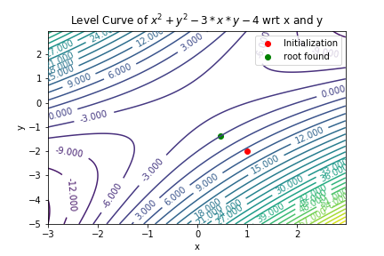
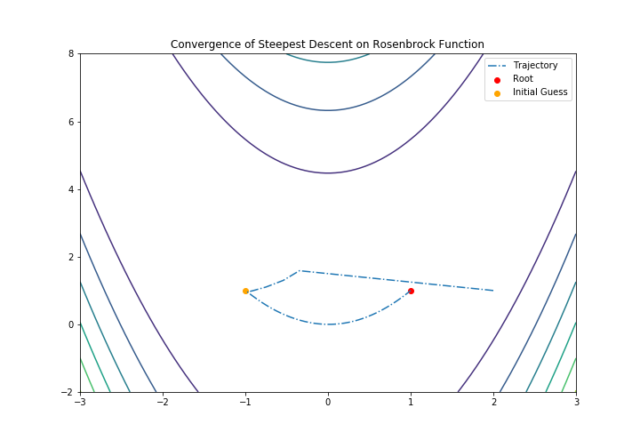
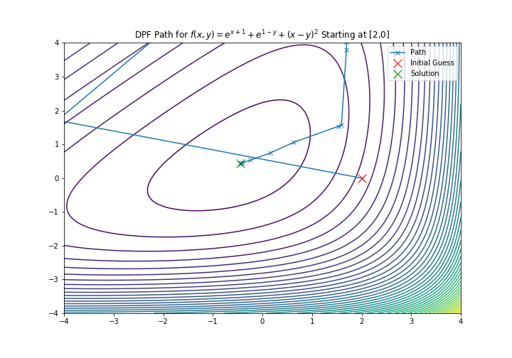

Additional features
=======================================

Our package comes with a library package containing the following methods:

- Newton's Root Finding
- Steepest Descent
- Broyden–Fletcher–Goldfarb–Shanno (BFGS)
- Davidon–Fletcher–Powell formula (DFP)
- Hamiltonian Monte Carlo(HMC)

All of these methods' implementations use our AnnoDomini package to solve for the gradients within the methods. We include demos of each method in the directory, demos.

A more detailed description of each method is provided below:

Newton's Root Finding
----------------------

Background
~~~~~~~~~~

Newton's root finding algorithm is a useful approach to finding the root(s) of functions that are difficult to solve for analytically, i.e. :math:`log(2x) + arctan(3x + 5)`.
Mathematically, the algorithm is given by

:math:`x_{n+1} = x_n - \frac{f(x_n)}{\prime{f(x_n)}}`

For the multivariate case:

:math:`x_{n+1} = x_n - (J(f)(x_n))^{-1} f(x_n)`

where we begin with an initial guess :math:`x_0` (scalar), and iterate until a maximum number of iters has been reached (default: 50 iters), or when the estimated root converges (:math:`x_{n+1} - x_n < T`, for some tolerance T).
A useful resource is found `here <http://tutorial.math.lamar.edu/Classes/CalcI/NewtonsMethod.aspx>`_.

API
~~~
``Newton Class``:

	- ``f``: function of interest. If f is a scaler function, we can define f as follows:
	
		.. code-block:: python
		
			# option one
			def f(x):
			   return np.sin(x) + x * np.cos(x)
			
			# option two
			f = lambda x: np.sin(x) + x * np.cos(x)
		
		if f is a multivariate function:
		
		.. code-block:: python
			
			def f(x,y):
				return x ** 2 + y ** 2 - 3 * x * y - 4 # (x-y)^2 = 9
			
			# or
			f = lambda x, y: x ** 2 + y ** 2 - 3 * x * y - 4
	
	
	- ``x0``: initial point to start. Support both scaler and vector expressions.
	
		.. code-block:: python
			
			x0 = [1,2,3] # supported
			x0 = 1 # supported
	
	- ``maxiter``: max iteration number if convergence not method
	
	- ``tol``: stop condition parameter. :math: `||x_n - x_{n-1}|| < tol`
	
	- ``alpha``: constant in the newtons_method. The smaller the smaller the step.
	
``find_root``: return a root of a function.

Demo
~~~~

.. code-block:: python

    >>> from AnnoDomini.newtons_method import Newton
    >>> import numpy as np
    >>> from scipy import linalg as la
    >>> f = lambda x: np.sin(x) + x * np.cos(x)
    >>> x0 = -3
    >>> demo = Newton(f,x0)
    >>> root = demo.find_root()
    >>> print(root)
    -2.028757838110434
    >>> quit()
    $ deactivate

And then we can do the visulization:

.. code-block:: python
	
	from matplotlib import pyplot as plt
	xs = np.linspace(-7,5,100)
	plt.plot(xs, f(xs), label="f")
	plt.scatter(root, f(root),label="Root", color = 'black')
	plt.scatter(x0, f(x0),label="initial", color = 'red')
	plt.xlabel("x")
	plt.ylabel("y")
	plt.title("Visual of Newton's Method on $sin(x) + x * cos(x)$")
	plt.axhline(y = 0, color = 'red')
	plt.legend()
	plt.show()

.. figure:: newtons_method.png
    :width: 2000px
    :align: center
    :height: 500px
    :alt: alternate text
    :figclass: align-center

.. code-block:: python

	>>> def f(x,y):
		return x ** 2 + y ** 2 - 3 * x * y - 4 # (x-y)^2 = 9
	>>> x0 = 1.0
	>>> y0 = -2.0
	>>> init_vars = [x0, y0]
	>>> demo = Newton(f,init_vars)
	>>> ans = demo.find_root()
	>>> print(ans)
	[0.45925007 -1.37598283]

And we can do the visulization by the following ways:

.. code-block:: python

    delta = 0.025 
    lam1 = np.arange(-3, 3, delta) 
    lam2 = np.arange(-5, 3, delta) 
    Lam1, Lam2 = np.meshgrid(lam1, lam2) 
    value = Lam1 ** 2 + Lam2 ** 2 - 3 * Lam1 * Lam2 -4
    CS = plt.contour(Lam1, Lam2, value,levels = 30) 
    plt.scatter(x0,y0,color = "red",label = "Initialization")
    plt.scatter(ans[0],ans[1],color = "green",label = "root found") 
    plt.clabel(CS, inline=1, fontsize=10) 
    plt.xlabel('x') 
    plt.ylabel('y') 
    plt.legend() 
    plt.title('Level Curve of $x^2 + y^2 - 3*x*y - 4$ wrt x and y')
    plt.savefig('newton_multivar.png')

	

A full demo of this method is available in the demos subdirectory.

Steepest Descent
----------------

Background
~~~~~~~~~~

Steepest Descent is an unconstrained optimization algorithm used to find the minima/maxima for a specified function. It achieves this by iteratively following the direction of the negative gradient at every step. We determine the optimal step size by following the line-search approach: evaluate the function over a range of possible stepsizes and choosing the minimum value.

Mathematically, the algorithm is give by

1. Initialize initial guess, :math:`x_0`
2. Compute :math:`s_k = -\nabla f(x_k)`
3. Iteratively update the estimated value, :math:`x_{k+1} = x_k + \eta_k s_k`, where :math:`\eta_k` is the optimal step size
4. Terminate if maximum number of iterations is reached, or :math:`x_{n+1} - x_n < T`, for some tolerance T

Our method works for both single and multivariable inputs, and single output functions. The user must input a function that accounts for specified number of variables desired. This method can be implemented as follows:

API
~~~

``SteepestDescent Class``:

	- ``f``: function of interest. If f is a scaler function, we can define f as follows:
	
		.. code-block:: python
		
			# option one
			def f(x):
			   return np.sin(x) + x * np.cos(x)
			
			# option two
			f = lambda x: np.sin(x) + x * np.cos(x)
		
		if f is a multivariate function:
		
		.. code-block:: python
			
			def f(args):
				[x,y] = args
				ans = 100*(y-x**2)**2 + (1-x)**2
				return ans
	
	- ``x0``: initial point to start. Support both scaler and vector expressions.
	
		.. code-block:: python
			
			x0 = [1,2,3] # supported
			x0 = 1 # supported
	
	- ``maxiter``: max iteration number if convergence not method
	
	- ``tol``: stop condition parameter. :math: `||x_n - x_{n-1}|| < tol`
	
	- ``step``: constant in the steepest descent. The smaller the smaller the step.
	
``find_root``: return a root of a function.

Demos
~~~~~

.. code-block:: python

    >>> from AnnoDomini.steepest_descent import SteepestDescent
    >>> import numpy as np
    >>> from scipy import linalg as la
    >>> def f(args):
    >>>     [x,y] = args
    >>>     ans = 100*(y-x**2)**2 + (1-x)**2
    >>>     return ans
    >>> x0 = [2,1]
    >>> sd = SteepestDescent(f, x0)
    >>> root = sd.find_root()
    >>> print(root)
    [1. 1.]

And also we can do the visualization:

.. code-block:: python

	X, Y = np.meshgrid(np.linspace(-3, 3, 100), np.linspace(-2, 8, 100))
	Z = f(np.array([X,Y]))
	fig = plt.subplots(1,1, figsize = (10,7))
	plt.contour(X, Y, Z)
	plt.plot(ans[:,0], ans[:,1], "-.", label="Trajectory")
	plt.scatter(root[0],root[1], label="Root", c="red")
	plt.scatter(-1,1, label="Initial Guess", c ="orange")
	plt.title("Convergence of Steepest Descent on Rosenbrock Function")
	plt.xlim(-3, 3)
	plt.ylim(-2, 8)
	plt.legend()
	plt.show()

A full demo of this method is available in the demos subdirectory.

Broyden–Fletcher–Goldfarb–Shanno (BFGS)
---------------------------------------

Background
~~~~~~~~~~

BFGS, or the Broyden–Fletcher–Goldfarb–Shanno algorithm, is a
first-order quasi-Newton optimization method, which approximates the Hessian matrix with the gradient and direction of a function.
The algorithm is as follows, in terms of the Approximate Hessian, :math:`B_k`, the step  :math:`s_k`, and :math:`y_k`

1. Solve for :math:`s_k` by solving the linear system :math:`B_k s_k = -y_k`
2. :math:`x_{k+1} = s_k + x_k`
3. :math:`y_k = \nabla x_{k+1} -  \nabla x_{k}`
4. :math:`B_{k+1} =  B_k + \frac{y_k y_k^T}{y_k^T s_k} + \frac{B_k s_k s_k^T B_k}{s_k^T B_k s_k}`
5. Terminate when :math:`s_k <` Tolerance

API
~~~

``BFGS Class``:

	- ``f``: function of interest. If f is a scaler function, we can define f as follows:
	
		.. code-block:: python
		
			# option one
			def f(x):
			   return np.sin(x) + x * np.cos(x)
			
			# option two
			f = lambda x: np.sin(x) + x * np.cos(x)
		
		if f is a multivariate function:
		
		.. code-block:: python
			
			def f(args):
				[x,y] = args
				ans = 100*(y-x**2)**2 + (1-x)**2
				return ans
	
	- ``x0``: initial point to start. Support both scaler and vector expressions.
	
		.. code-block:: python
			
			x0 = [1,2,3] # supported
			x0 = 1 # supported
	
	- ``maxiter``: max iteration number if convergence not method
	
	- ``tol``: stop condition parameter. :math: `||x_n - x_{n-1}|| < tol`
	
``find_root``: return a root of a function.

Demos
~~~~~

This method can be implemented as follows:

.. code-block:: python

    >>> from AnnoDomini.BFGS import BFGS
    >>> import numpy as np
    >>> from scipy import linalg as la
    >>> def f(args):
    >>>     [x,y] = args
    >>>     ans = 100*(y-x**2)**2 + (1-x)**2
    >>>     return ans
    >>> x0 = [2,1]
    >>> sd = BFGS(f, x0)
    >>> root = sd.find_root()
    >>> print(root)
    [1. 1.]
	
And the visualization could be done:

.. code-block:: python

    X, Y = np.meshgrid(np.linspace(-3, 3, 100), np.linspace(-2, 8, 100))
    Z = f(np.array([X, Y]))
    xmesh, ymesh = np.mgrid[-4:4:80j, -4:4:80j]
    fmesh = f(np.array([xmesh, ymesh]))
    fig = plt.subplots(1,1, figsize = (10,7))
    plt.title('BFGS Path for Rosenbrock’s Function, Starting at [2,1]')
    plt.xlim(-4, 4)
    plt.ylim(-4, 4)
    plt.contour(xmesh, ymesh, fmesh, 50)
    it_array = np.array(ans)
    plt.plot(it_array.T[0], it_array.T[1], "x-", label="Path")
    plt.plot(it_array.T[0][0], it_array.T[1][0], 'xr', label='Initial Guess', markersize=12)
    plt.plot(it_array.T[0][-1], it_array.T[1][-1], 'xg', label='Solution', markersize=12)
    plt.legend()

.. figure:: BFGS.png
    :width: 2000px
    :align: center
    :height: 500px
    :alt: alternate text
    :figclass: align-center

A full demo of this method is available in the demos subdirectory.

Davidon–Fletcher–Powell formula (DFP)
-------------------------------------

Background
~~~~~~~~~~

DFP, or the Davidon–Fletcher–Powell formula, is another
first-order quasi-Newton optimization method, which also approximates the Hessian matrix with the gradient and direction of a function.
The algorithm is as follows, in terms of the Approximate Hessian, :math:`B_k`, the step  :math:`s_k`, :math:`\gamma_k  = \frac{1}{y_k^T s_k}`

1. Solve for :math:`s_k` by solving the linear system :math:`B_k s_k = -y_k`
2. :math:`x_{k+1} = s_k + x_k`
3. :math:`y_k = \nabla x_{k+1} -  \nabla x_{k}`
4. :math:`B_{k+1} =  (I - \gamma_k y_k s_k^T)B_k(I - \gamma_k s_k y_k^T) + \gamma_k y_k y_k^T`
5. Terminate when :math:`s_k <` Tolerance

API
~~~

``DFP Class``:

	- ``f``: function of interest. If f is a scaler function, we can define f as follows:
	
		.. code-block:: python
		
			# option one
			def f(x):
			   return np.sin(x) + x * np.cos(x)
			
			# option two
			f = lambda x: np.sin(x) + x * np.cos(x)
		
		if f is a multivariate function:
		
		.. code-block:: python
			
			def f(args):
				[x, y] = args
				return np.e**(x+1) + np.e**(-y+1) + (x-y)**2
	
	- ``x0``: initial point to start. Support both scaler and vector expressions.
	
		.. code-block:: python
			
			x0 = [1,2,3] # supported
			x0 = 1 # supported
	
	- ``maxiter``: max iteration number if convergence not method
	
	- ``tol``: stop condition parameter. :math: `||x_n - x_{n-1}|| < tol`
	
``find_root``: return a root of a function.

Demos
~~~~~

This method can be implemented as follows:

.. code-block:: python

    >>> from AnnoDomini.DFP import DFP
    >>> import numpy as np
    >>> from scipy import linalg as la
    >>> def f(args):
    >>>     [x,y] = args
    >>>     return np.e**(x+1) + np.e**(-y+1) + (x-y)**2
    >>> x0 = [2,0]
    >>> sd = DFP(f, x0)
    >>> root = sd.find_root()
    >>> print(root)
    [-0.43837842  0.43837842]
	
.. code-block:: python

    X, Y = np.meshgrid(np.linspace(-3, 3, 100), np.linspace(-2, 8, 100))
    Z = f(np.array([X, Y]))
    xmesh, ymesh = np.mgrid[-4:4:80j, -4:4:80j]
    fmesh = f(np.array([xmesh, ymesh]))
    fig = plt.subplots(1,1, figsize = (10,7))
    plt.title('DPF Path for $f(x,y) = e^{x+1} + e^{1-y} + {(x-y)}^2$ Starting at [2,0]')
    plt.xlim(-4, 4)
    plt.ylim(-4, 4)
    plt.contour(xmesh, ymesh, fmesh, 50)
    it_array = np.array(ans)
    plt.plot(it_array.T[0], it_array.T[1], "x-", label="Path")
    plt.plot(it_array.T[0][0], it_array.T[1][0], 'xr', label='Initial Guess', markersize=12)
    plt.plot(it_array.T[0][-1], it_array.T[1][-1], 'xg', label='Solution', markersize=12)
    plt.legend()

A full demo of this method is available in the demos subdirectory.

.. note::  DFP is empirically significantly less performant than BFPS. For instance, it may take up to 1 million iterations to converge on the Rosenbrock function.

Hamiltonian Monte Carlo
-----------------------

Background
~~~~~~~~~~

In computational physics and statistics, the Hamiltonian Monte Carlo algorithm is a Markov chain Monte Carlo method for obtaining a sequence of random samples which converge to being distributed according to a target probability distribution for which direct sampling is difficult. This sequence can be used to estimate integrals with respect to the target distribution (expected values).

Hamiltonian Monte Carlo corresponds to an instance of the Metropolis–Hastings algorithm, with a Hamiltonian dynamics evolution simulated using a time-reversible and volume-preserving numerical integrator (typically the leapfrog integrator) to propose a move to a new point in the state space. Compared to using a Gaussian random walk proposal distribution in the Metropolis–Hastings algorithm, Hamiltonian Monte Carlo reduces the correlation between successive sampled states by proposing moves to distant states which maintain a high probability of acceptance due to the approximate energy conserving properties of the simulated.

An easy way to implement Hamiltonian Monte Carlo is to use leap frog Integrator. The implementation is as follows:

Let :math:`\pi(q)` be our target distribution with :math:`q\in \mathbb{R}^D`. We turn :math:`\pi` into an energy function :math:`U(q)` by :math:`U(q) = - \log(\pi(q))`. We choose a kinetic energy function :math:`K(p)`.

0. start with a random :math:`q^{(0)}\in\mathbb{R}^D`

1. repeat:

- A. (kick-off) sample a random momentum from the Gibbs distribution of :math:`K(p)`, i.e.
:math:`p^{(current)} \sim \frac{1}{Z} \exp(-K(p))`

- B. (simulate movement) simulate Hamiltonian motion for :math:`L` steps each with time interval :math`\epsilon`, using the leap-frog integrator. 

	- a. Repeat for T - 1 times, for :math:`p^{(\text{step } 0)} = p^{(current)}`, :math:`q^{(\text{step } 0)} = q^{(current)}`
	
		- i.(half-step update for momentum) :math:`p^{(\text{step } t + 1/2)} \leftarrow  p^{(\text{step } t)} - \epsilon/2 \frac{\partial U}{\partial q}(q^{(\text{step } t)})`
		
		- ii.(full-step update for position) :math:`q^{(\text{step } t + 1)} \leftarrow q^{(\text{step } t)} + \epsilon \frac{\partial K}{\partial p}(p^{(\text{step } t}))`
		
		- iii. (half-step update for momentum) :math:`p^{(\text{step } t + 1)} \leftarrow  p^{(\text{step } t + 1/2)} - \epsilon/2 \frac{\partial U}{\partial q}(q^{(\text{step } t + 1)})`
	
	- b.(reverse momentum) :math:`p^{(\text{step}T)} \leftarrow -p^{(\text{step}T)}`

- C. (correction for simulation error) implement Metropolis-Hasting accept mechanism: 

	- a. compute :math:`\alpha = \min\left(1, \exp\left\{H(q^{(current)}, p^{(current)}) - H(q^{(\text{step } T)}, p^{(\text{step } T)})\right\} \right)`
	
	- b. sample :math:`U\sim U(0, 1)`, if :math:`U \leq \alpha`then accept, else keep old sample

In our implementation, we use the simplist Euclidean-Gaussian Kinetic Energy function, i.e.

:math:`K(p) = \frac{1}{2} p^\top M^{-1} p + \frac{1}{2}\log|M| + \frac{D}{2} \log(2\pi)`

API
~~~
``HMC``:

- ``q_init``: initial point to start with. For the scaler case, we support both scaler and list input like [0].

- ``target_pdf`` and ``Ù``. Target density function to sample from and target negative log (density function). If target_pdf is provided, U would be calculated via:

.. code-block:: python

	U = lambda q: -np.log(target_pdf(q))

However, since there would be cases where negative log density function is easier to obtain, users can specify U directly. In this case, target_pdf would be ignored.

- ``D``: dimension of the input. Could be infered from the q_init and also could be specified directly.

- ``chain_len``: length of hamiltonian monte carlo chain. default 1000

- `` T``: length of leapfrog in HMC, default 5

-  ``burn_in``, ``thinning``: burn in and thinning to the chain. default 0 and 1

- ``epsilon``:  step length in the HMC for the leap-frog.

``describe``: a straight forward way to estimate the mean, variance and quantiles for a certain distribution based on HMC.

The ``describe`` shares same parameters with HMC. It returns a dict where the mean, variance and quantiles are stored in the "mean", "var" and "quantiles".

Demos
~~~~~

Here is a demo for singular Gaussian family.

.. code-block:: python

	>>> import numpy as np
	>>> from AnnoDomini.hamilton_mc import HMC, describe
	>>> def norm_function(mu = 0, var = 1):
		def norm(x):
			denom = (2*np.pi*var)**.5
			num = np.exp(-(x-mu)**2/(2*var))
			return num/denom
		return norm

	>>> start_point = -10.0 # start from far apart
	>>> func = norm_function(1,1)

	>>> chain,accepts_ratio = HMC(target_pdf = func, burn_in=200, thinning=2,chain_len=10000, q_init=[start_point],epsilon = 0.05)
	100%|██████████| 10000/10000 [00:05<00:00, 1706.38it/s]
	>>> print("Accepts ratio = {}".format(accepts_ratio))
	Accepts ratio = 0.9919
	>>> print(chain.shape)
	(4900, 1)

.. note:: accepts_ratio is a good indicator for the quanlity of the chain. it should be greater than 90%. If not, try to adjust epsilon and T in the leap-frog stage.

We can visually check the correctness of HMC by:

.. code-block:: python

    q = chain[:,0]
    fig,ax = plt.subplots(1,1,figsize = (8,5))
    x = np.linspace(-4,4)
    ax.plot(x,func(x),color = "black",label = "actual pdf")
    ax.hist(q,bins = 50, density = True, color = "blue",alpha = 0.3, label = "histogram of samples")
    ax.set_title("Actual pdf vs sampling by hamiltonian monte carlo")
    ax.legend()

.. figure:: hmc_simulation_normal.png
    :width: 2000px
    :align: center
    :height: 500px
    :alt: alternate text
    :figclass: align-center
	
And describe function could be used to estimate mean and variance by:

.. code-block:: python

	>>> import numpy as np
	>>> from AnnoDomini.hamilton_mc import HMC, describe
	>>> def norm_function(mu = 0, var = 1):
		def norm(x):
			denom = (2*np.pi*var)**.5
			num = np.exp(-(x-mu)**2/(2*var))
			return num/denom
		return norm

	>>> start_point = -10.0 # start from far apart
	>>> func = norm_function(1,0.1)

	>>> chain,accepts_ratio = describe(target_pdf = func, burn_in=200, thinning=2,chain_len=10000, q_init=[start_point],epsilon = 0.05)
	100%|██████████| 10000/10000 [00:05<00:00, 1706.38it/s]
	
	>>> print("Accepts ratio = \{\}".format(accepts_ratio))
	Accepts ratio = 0.9267

.. code-block:: python

	>>> print("Mean = \{\}".format(d['mean'])) # 1
	Mean = 0.9976236280753902
	>>> print("Var = \{\}".format(d['var'])) # 0.1
	Var = 0.1267435837161925
	>>> print("quantiles(25%, 75%) = \{\}".format(d['quantiles']))
	quantiles(25%, 75%) = [0.75131308 1.23747691]
	
A full demo of this method is available in the demos subdirectory. (Includes the weibull distribution)

