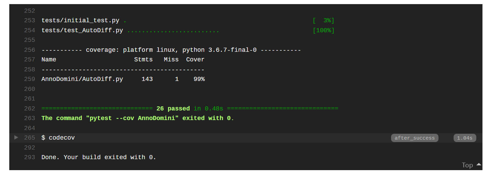

Software Organization
=======================================

Directory Structure
-------------------
::

  AnnoDomini/
    AutoDiff.py
  docs/
    source/
      .index.rst.swp
      conf.py
      index.rst (documentation file)
    Makefile
    make.bat
    milestone1.md
  tests/
    initial_test.py
    test_AutoDiff.py
  .gitignore
  .travis.yml
  LICENSE
  README.md

Basic Modules
-------------
- AutoDiff.py

  - Contains implementation of the master class and its methods for calculating derivatives of elementary functions (list of methods shown in **Core Classes** section below).

Testing
-------

- Where do the tests live?
- How are they run?
- How are they integrated?

Our tests are contained in tests directory. test_AutoDiff.py is used to test the functions in the AutoDiff Class.

Our test suites are hosted through TravisCI and CodeCov. We run TravisCI first to test the accuracy and CodeCov to test the test coverage. The results can be inferred via the README section.

Our tests are integrated via the TravisCI. that is, call ask TravisCI to CodeCov after completion.

Packaging
---------
Details on how to install our package are included in the section, `How to use Anno Domini <https://cs207-finalproject-group15.readthedocs.io/en/latest/how_to_use.html>`_.

We use Git to develop the package; after we notice that the package is mature, we follow instructions `here <https://python\-packaging.readthedocs.io/en/latest/>`_ to package our code and distribute it on PyPi. Instead of using a framework such as PyScaffold, we will adhere to the proposed directory structure. We provide necessary documentation via .rst files (rendered through Sphinx) to provide a clean, readable format on Github.
